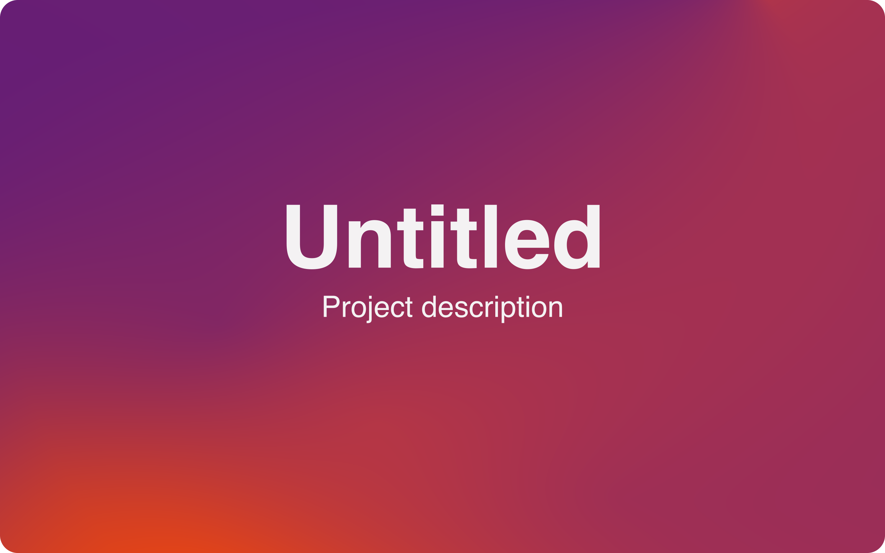

**Dach**: Democratizing the creation of elegant banners for everyone's project.

> **Note**
> This project is still in early development.
> I would be extremely grateful for any feedback, issue or contribution.

## Overview

### Description

Dach is a command-line tool that you most probably will use only once per project.
You can either pass it arguments or create a configuration file. The decision to throw
another configuration file into your project's dotfiles is up to you.

Usage of more advanced options is only possible through the configuration file.

### Example usage

Simple banner:

```bash
dach
  --title "My Awesome Project"
  --description "This is my awesome project"
  --output ".github/banner.png"
```

Banner using config file:

```bash
dach
  --title "My Awesome Project"
  --description "This is my awesome project"
  --output ".github/banner.png"
```

Banner using gradient presets:

```bash
dach
  --title "My Awesome Project"
  --description "This is my awesome project"
  --output ".github/banner.png"
```

> **Note**
> You can find example config files in the `test/fixtures` directory.

## Arguments

<table>
    <tr>
        <th>Argument</th>
        <th>Alias</th>
        <th>Description</th>
        <th>Default</th>
    </tr>
    <tr>
        <td><code>--config</code></td>
        <td><code>-c</code></td>
        <td>Path to config file.</td>
        <td><code>[cwd]/assets/dach.config.json</code></td>
    </tr>
    <tr>
        <td><code>--output</code></td>
        <td><code>-o</code></td>
        <td>Output directory</td>
        <td><code>[cwd]/assets</code></td>
    </tr>
    <tr>
        <td><code>--title</code></td>
        <td><code>-t</code></td>
        <td>The title of your project.</td>
        <td><code>-</code></td>
    </tr>
    <tr>
        <td><code>--title-color</code></td>
        <td><code>-tc</code></td>
        <td>Color of title text</td>
        <td><code>#FFFFFF</code></td>
    </tr>
    <tr>
        <td><code>--description</code></td>
        <td><code>-d</code></td>
        <td>Project description</td>
        <td><code>-</code></td>
    </tr>
    <tr>
        <td><code>--description-color</code></td>
        <td><code>-d</code></td>
        <td>Color of the description text</td>
        <td><code>#FFFFFF</code></td>
    </tr>
    <tr>
        <td><code>--dimensions</code></td>
        <td><code>-dim</code></td>
        <td>Dimensions of the banner.</td>
        <td><code>4000x1600</code></td>
    </tr>
    <tr>
        <td><code>--background-type</code></td>
        <td><code>-b</code></td>
        <td>Background type (gradient or plain).</td>
        <td><code>Plain</code></td>
    </tr>
    <tr>
        <td><code>--gradient-positions-preset</code></td>
        <td><code>-gpp</code></td>
        <td>Gradient positions preset.</td>
        <td><code>None</code></td>
    </tr>
    <tr>
        <td><code>--gradient-colors-preset</code></td>
        <td><code>-gcp</code></td>
        <td>Gradient colors preset.</td>
        <td><code>None</code></td>
    </tr>
    <tr>
        <td><code>--background-color</code></td>
        <td><code>-bc</code></td>
        <td>Color of banner background.</td>
        <td><code>#171717</code></td>
    </tr>

</table>

> **Note**
> When `--background-type` is set to `gradient`, `--gradient-positions-preset` and
> `--gradient-colors-preset` are mandatory. When `--background-type` is set to `plain`,
> `--background-color` is mandatory.

## Example banners




## Installation

## Contributing

## License
